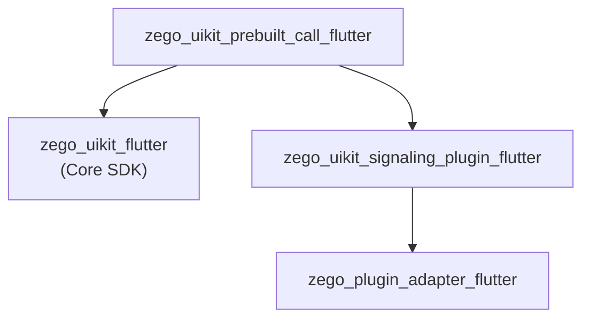
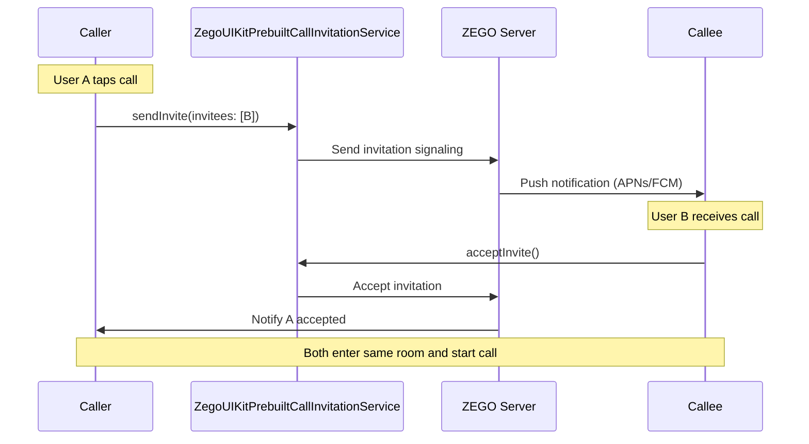

# ZegoUIKitPrebuiltCall Architecture

> 1-on-1 and group audio/video call SDK, based on zego_uikit_flutter

## Overview

`zego_uikit_prebuilt_call_flutter` is a **prebuilt call UI SDK** providing:
- 1-on-1 video/voice calls
- Group video/voice calls
- Call invitations (online/offline)
- Device detection and control
- Minimizing/PiP support
- Screen sharing

**Depends on**: `zego_uikit_flutter` (core SDK)

## Package Relationship



## Core Pattern: Prebuilt UI + Controller

This package provides complete UI and business logic through these core classes:

```
ZegoUIKitPrebuiltCall        # Main Widget (UI + state)
       ↓
ZegoUIKitPrebuiltCallController  # Singleton controller (business logic)
       ↓
ZegoUIKitPrebuiltCallInvitationService  # Invitation service singleton
```

## Quick Start

### Basic Call

```dart
import 'package:zego_uikit_prebuilt_call/zego_uikit_prebuilt_call.dart';

class CallPage extends StatelessWidget {
  @override
  Widget build(BuildContext context) {
    return ZegoUIKitPrebuiltCall(
      appID: yourAppID,
      appSign: yourAppSign,
      userID: currentUserID,
      userName: currentUserName,
      callID: targetCallID,
      config: ZegoUIKitPrebuiltCallConfig.oneOnOneVideoCall(),
    );
  }
}
```

### With Invitation Feature

```dart
// 1. Initialize invitation service
void initInvitationService() {
  ZegoUIKitPrebuiltCallInvitationService().init(
    appID: appID,
    appSign: appSign,
    userID: userID,
    userName: userName,
    config: ZegoCallInvitationConfig(
      timeout: 60,
      offline: ZegoCallOfflineInvitationConfig(enabled: true),
    ),
  );
}

// 2. Use call component
ZegoUIKitPrebuiltCall(
  appID: appID,
  appSign: appSign,
  userID: userID,
  userName: userName,
  callID: callID,
  config: ZegoUIKitPrebuiltCallConfig.oneOnOneVideoCall(),
  events: ZegoUIKitPrebuiltCallEvents(
    onHangUp: (context, reason) {
      Navigator.pop(context);
    },
    onCallEnd: (context, reason) {
      Navigator.pop(context);
    },
  ),
)
```

### Send Invitation

```dart
// Send video call invitation
await ZegoUIKitPrebuiltCallInvitationService().send(
  invitees: ['userID1', 'userID2'],
  type: ZegoCallType.videoCall,
);

// Send voice call invitation
await ZegoUIKitPrebuiltCallInvitationService().send(
  invitees: ['userID1'],
  type: ZegoCallType.voiceCall,
);
```

## Configuration Pattern

### Factory Methods

```dart
// 1v1 video call
final config = ZegoUIKitPrebuiltCallConfig.oneOnOneVideoCall();

// 1v1 voice call
final config = ZegoUIKitPrebuiltCallConfig.oneOnOneVoiceCall();

// Group video call
final config = ZegoUIKitPrebuiltCallConfig.groupVideoCall();

// Group voice call
final config = ZegoUIKitPrebuiltCallConfig.groupVoiceCall();
```

### Builder Pattern Customization

```dart
ZegoUIKitPrebuiltCallConfig config = ZegoUIKitPrebuiltCallConfig.oneOnOneVideoCall()
  // Device state when joining
  ..turnOnCameraWhenJoining = false
  ..turnOnMicrophoneWhenJoining = true
  ..useFrontCameraWhenJoining = true
  ..useSpeakerWhenJoining = true

  // Video config
  ..video = ZegoUIKitVideoConfig.preset720p()

  // Top menu bar
  ..topMenuBarConfig(
    title: 'Video Call',
    showMicrophoneState: true,
    showCameraState: true,
    buttons: [ZegoCallMenuBarButtonName.minimize],
  )

  // Bottom menu bar
  ..bottomMenuBarConfig(
    buttons: [
      ZegoCallMenuBarButtonName.toggleMicrophone,
      ZegoCallMenuBarButtonName.toggleCamera,
      ZegoCallMenuBarButtonName.switchCamera,
      ZegoCallMenuBarButtonName.hangUp,
    ],
  )

  // Member list
  ..memberListConfig(
    showMicrophoneState: true,
    showCameraState: true,
  )

  // Chat view
  ..chatViewConfig(
    showInCallMessage: true,
  )

  // Beauty
  ..beauty = ZegoBeautyPluginConfig()
    ..smooth = 50
    ..whiten = 30;
```

### Complete Config Options

| Config | Type | Default | Description |
|--------|------|---------|-------------|
| `turnOnCameraWhenJoining` | bool | `true` | Whether to turn on camera when joining |
| `turnOnMicrophoneWhenJoining` | bool | `true` | Whether to turn on microphone when joining |
| `useFrontCameraWhenJoining` | bool | `true` | Whether to use front camera |
| `useSpeakerWhenJoining` | bool | `false` | Whether to use speaker |
| `enableAccidentalTouchPrevention` | bool | `true` | Enable accidental touch prevention |
| `video` | `ZegoUIKitVideoConfig` | `preset360p` | Video quality config |

## Controller API

Control calls via `ZegoUIKitPrebuiltCallController()` singleton:

```dart
final controller = ZegoUIKitPrebuiltCallController();

// Hang up call
await controller.hangUp(context);

// Minimize
controller.minimize.minimize(context);
controller.minimize.restore(context);

// PiP (iOS)
controller.pip.startPiP();

// Audio/video control
controller.audioVideo.muteMicrophone(true);
controller.audioVideo.muteCamera(true);

// Screen sharing
controller.screenSharing.startScreenSharing();
controller.screenSharing.stopScreenSharing();
```

### Controller Mixins

| Mixin | Description |
|-------|-------------|
| `ZegoCallControllerAudioVideo` | Audio/video device control |
| `ZegoCallControllerMinimizing` | Minimize/restore |
| `ZegoCallControllerPIP` | Picture-in-picture control |
| `ZegoCallControllerScreenSharing` | Screen sharing |
| `ZegoCallControllerInvitation` | Call invitation |
| `ZegoCallControllerUser` | User operations |
| `ZegoCallControllerRoom` | Room operations |
| `ZegoCallControllerPermission` | Permission management |

## Events

### Call Events

```dart
ZegoUIKitPrebuiltCallEvents(
  // Hang up confirmation
  onHangUpConfirmation: (context) {
    return showDialog(...);
  },

  // Call end
  onCallEnd: (context, reason) {
    print('Call ended: $reason');
  },

  // Error callback
  onError: (context, errorCode, errorMessage) {
    print('Error: $errorCode - $errorMessage');
  },

  // User join/leave
  onUserJoin: (user) {
    print('User joined: ${user.name}');
  },
  onUserLeave: (user) {
    print('User left: ${user.name}');
  },

  // Device state changed (by others)
  onMicrophoneTurnOnByOthers: (userID) {},
  onMicrophoneTurnOffByOthers: (userID) {},
  onCameraTurnOnByOthers: (userID) {},
  onCameraTurnOffByOthers: (userID) {},
  onSpeakerTurnOnByOthers: (userID) {},
  onSpeakerTurnOffByOthers: (userID) {},

  // Screen sharing
  onScreenSharingStarted: (user) {},
  onScreenSharingStopped: (user) {},

  // Custom command
  onReceiveCustomCommand: (fromUser, command) {},
)
```

### Invitation Events

```dart
// Used with ZegoUIKitPrebuiltCallInvitationService
ZegoCallInvitationEvents(
  onIncomingInvitationReceived: (caller, callType) {},
  onIncomingInvitationAccepted: (acceptor) {},
  onIncomingInvitationRejected: (rejector) {},
  onIncomingInvitationCancelled: (caller) {},
  onOutgoingInvitationAccepted: (callee) {},
  onOutgoingInvitationRejected: (callee) {},
  onOutgoingInvitationTimeout: (callee) {},
)
```

## UI Customization

### Custom Avatar

```dart
config.avatarBuilder = (BuildContext context, Size size, ZegoUIKitUser? user, Map extraInfo) {
  if (user == null) return SizedBox();
  return Container(
    decoration: BoxDecoration(
      shape: BoxShape.circle,
      image: DecorationImage(
        image: NetworkImage('https://api.example.com/avatar/${user.id}'),
      ),
    ),
  );
};
```

### Custom Background

```dart
config.background = Container(
  decoration: BoxDecoration(
    gradient: LinearGradient(
      begin: Alignment.topCenter,
      end: Alignment.bottomCenter,
      colors: [Colors.blue, Colors.purple],
    ),
  ),
);
```

### Custom Foreground Layer

```dart
config.foreground = Stack(
  children: [
    // Custom widget
    Positioned(
      top: 50,
      right: 20,
      child: Container(
        padding: EdgeInsets.all(8),
        decoration: BoxDecoration(
          color: Colors.black54,
          borderRadius: BorderRadius.circular(8),
        ),
        child: Text('Custom Widget'),
      ),
    ),
  ],
);
```

## Directory Structure

```
lib/src/
├── call.dart                    # Main entry Widget
├── controller.dart              # Controller singleton (mixin pattern)
├── config.dart                  # ZegoUIKitPrebuiltCallConfig
├── events.dart                  # ZegoUIKitPrebuiltCallEvents
├── defines.dart                 # Public defines
├── config.defines.dart          # Config-related defines
├── events.defines.dart          # Event defines
├── inner_text.dart              # Internal text (i18n)
├── components/                  # UI components
│   ├── components.dart
│   ├── top_menu_bar.dart        # Top menu bar
│   ├── bottom_menu_bar.dart     # Bottom menu bar
│   ├── member/
│   │   └── member_list.dart     # Member list
│   ├── message/                 # Chat related
│   ├── effects/                 # Beauty effects
│   ├── pip_button.dart          # PiP button
│   ├── mini_call_page.dart      # Minimized page
│   ├── mini_calling_page.dart    # Minimized calling page
│   └── pop_up_manager.dart      # Popup management
├── controller/                  # Controller mixins (public API)
│   ├── audio_video.dart         # Audio/video control
│   ├── invitation.dart          # Invitation control
│   ├── minimize.dart            # Minimize control
│   ├── pip.dart                 # PiP control
│   ├── room.dart                # Room operations
│   ├── screen_sharing.dart      # Screen sharing
│   ├── user.dart                # User operations
│   ├── permission.dart          # Permission management
│   ├── log.dart                 # Logging
│   └── private/                 # Private implementations
│       ├── audio_video.dart
│       ├── minimize.dart
│       ├── pip.dart
│       ├── screen_sharing.dart
│       └── user.dart
├── invitation/                  # Call invitation feature
│   ├── service.dart             # ZegoUIKitPrebuiltCallInvitationService
│   ├── config.dart              # ZegoCallInvitationConfig
│   ├── defines.dart
│   ├── callkit/                 # iOS CallKit
│   │   ├── background_service.dart
│   │   └── ...
│   ├── notification/            # Android notification
│   │   └── ...
│   ├── pages/
│   │   └── calling/             # Calling page
│   │       ├── calling_page.dart
│   │       ├── machine.dart     # State machine
│   │       └── config.dart
│   └── mixins/
├── minimizing/                   # Minimize/PiP
│   ├── overlay_machine.dart     # Overlay state machine
│   ├── data.dart                # Data classes
│   └── defines.dart
├── internal/                   # Internal utilities
│   ├── events.dart
│   └── reporter.dart
└── channel/                    # Platform channel
```

## Invitation Flow



## Dependency Packages

| Package | Version | Purpose |
|---------|---------|---------|
| `zego_uikit` | ^3.0.0 | Core SDK |
| `zego_plugin_adapter` | ^2.14.2 | Plugin adapter |
| `zego_uikit_signaling_plugin` | ^2.8.20 | Signaling plugin |
| `statemachine` | ^3.4.0 | State machine |
| `permission_handler` | ^12.0.1 | Permission management |
| `flutter_callkit_incoming` | ^2.5.5 | iOS CallKit |
| `flutter_volume_controller` | ^1.3.3 | Volume control |
| `proximity_sensor` | ^1.3.9 | Proximity sensor |
| `screen_brightness` | ^0.2.2+1 | Screen brightness |
| `floating` | ^6.0.0 | Android floating |

## Common Issues & Solutions

### 1. Must Initialize Invitation Service First

Must call `init()` before using invitation features:

```dart
// ✓ Correct
await ZegoUIKitPrebuiltCallInvitationService().init(...);
await ZegoUIKitPrebuiltCallInvitationService().send(...);

// ✗ Wrong - will crash
await ZegoUIKitPrebuiltCallInvitationService().send(...);  // Not initialized
```

### 2. iOS Requires CallKit Configuration

iOS needs:
- App Groups configuration (for data sharing)
- CallKit entitlement
- Correct Bundle ID

```xml
<!-- ios/Runner/Info.plist -->
<key>UIBackgroundModes</key>
<array>
    <string>voip</string>
</array>
```

### 3. Android Offline Invitation Requires HMS

Android offline invitation requires Huawei HMS integration:
- Add HMS dependencies
- Configure AppGalleryConnect
- Implement `ZegoCallNotificationConfig`

### 4. Minimized Hang Up

```dart
// Hang up while minimized
controller.minimize.hangUp(context);  // Use minimize's hangUp

// Don't call directly
controller.hangUp(context);  // May not work when minimized
```

## State Notifiers

Components expose state via `ValueNotifier`:

```dart
// Call duration
ValueNotifier<Duration> durationNotifier;

// Waiting accept users
ValueNotifier<List<ZegoUIKitUser>> waitingAcceptUserNotifier;

// UI bar visibility
ValueNotifier<bool> barVisibilityNotifier;

// Chat view visibility
ValueNotifier<bool> chatViewVisibleNotifier;
```

## Related Documentation

- [ZegoUIKit Architecture](../zego_uikit_flutter/ARCHITECTURE.md)
- [ZegoUIKitSignalingPlugin Architecture](../zego_uikit_signaling_plugin_flutter/ARCHITECTURE.md)
