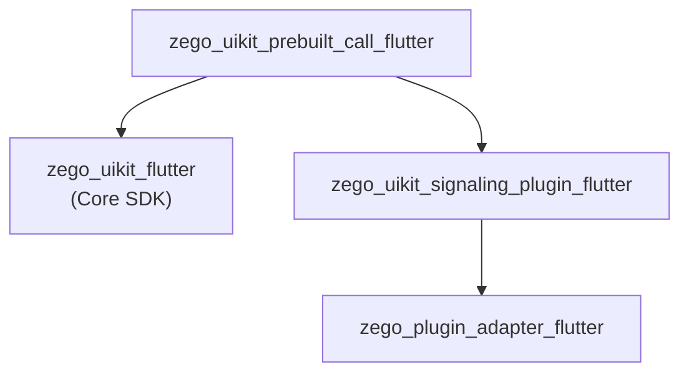
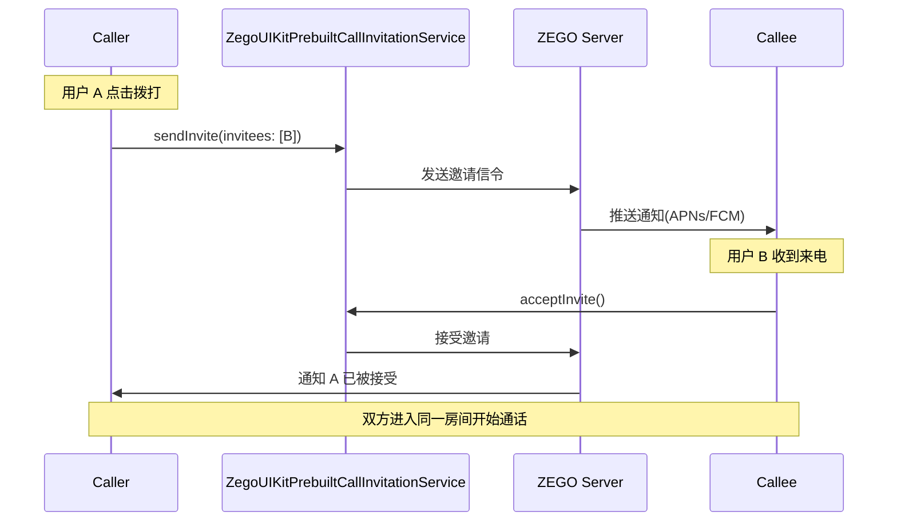

# ZegoUIKitPrebuiltCall Architecture

> 1对1和群组音视频通话 SDK，基于 zego_uikit_flutter

## Overview

`zego_uikit_prebuilt_call_flutter` 是**预构建的通话UI SDK**，提供：
- 1对1 视频/语音通话
- 群组视频/语音通话
- 通话邀请（在线/离线）
- 设备检测与控制
- 最小化/PiP 支持
- 屏幕共享

**依赖**: `zego_uikit_flutter` (核心SDK)

## Package Relationship



## Core Pattern: Prebuilt UI + Controller

此包提供完整的 UI 和业务逻辑，通过以下核心类交互：

```
ZegoUIKitPrebuiltCall        # 主 Widget（UI + 状态）
       ↓
ZegoUIKitPrebuiltCallController  # 单例控制器（业务逻辑）
       ↓
ZegoUIKitPrebuiltCallInvitationService  # 邀请服务单例
```

## Quick Start

### 基础通话

```dart
import 'package:zego_uikit_prebuilt_call/zego_uikit_prebuilt_call.dart';

class CallPage extends StatelessWidget {
  @override
  Widget build(BuildContext context) {
    return ZegoUIKitPrebuiltCall(
      appID: yourAppID,
      appSign: yourAppSign,
      userID: currentUserID,
      userName: currentUserName,
      callID: targetCallID,
      config: ZegoUIKitPrebuiltCallConfig.oneOnOneVideoCall(),
    );
  }
}
```

### 带邀请功能的通话

```dart
// 1. 初始化邀请服务
void initInvitationService() {
  ZegoUIKitPrebuiltCallInvitationService().init(
    appID: appID,
    appSign: appSign,
    userID: userID,
    userName: userName,
    config: ZegoCallInvitationConfig(
      timeout: 60,
      offline: ZegoCallOfflineInvitationConfig(enabled: true),
    ),
  );
}

// 2. 使用通话组件
ZegoUIKitPrebuiltCall(
  appID: appID,
  appSign: appSign,
  userID: userID,
  userName: userName,
  callID: callID,
  config: ZegoUIKitPrebuiltCallConfig.oneOnOneVideoCall(),
  events: ZegoUIKitPrebuiltCallEvents(
    onHangUp: (context, reason) {
      Navigator.pop(context);
    },
    onCallEnd: (context, reason) {
      Navigator.pop(context);
    },
  ),
)
```

### 发送邀请

```dart
// 发送视频通话邀请
await ZegoUIKitPrebuiltCallInvitationService().send(
  invitees: ['userID1', 'userID2'],
  type: ZegoCallType.videoCall,
);

// 发送语音通话邀请
await ZegoUIKitPrebuiltCallInvitationService().send(
  invitees: ['userID1'],
  type: ZegoCallType.voiceCall,
);
```

## Configuration Pattern

### 工厂方法创建配置

```dart
// 1v1 视频通话
final config = ZegoUIKitPrebuiltCallConfig.oneOnOneVideoCall();

// 1v1 语音通话
final config = ZegoUIKitPrebuiltCallConfig.oneOnOneVoiceCall();

// 群组视频通话
final config = ZegoUIKitPrebuiltCallConfig.groupVideoCall();

// 群组语音通话
final config = ZegoUIKitPrebuiltCallConfig.groupVoiceCall();
```

### Builder 模式自定义

```dart
ZegoUIKitPrebuiltCallConfig config = ZegoUIKitPrebuiltCallConfig.oneOnOneVideoCall()
  // 入会时设备状态
  ..turnOnCameraWhenJoining = false
  ..turnOnMicrophoneWhenJoining = true
  ..useFrontCameraWhenJoining = true
  ..useSpeakerWhenJoining = true

  // 视频配置
  ..video = ZegoUIKitVideoConfig.preset720p()

  // 顶部导航栏
  ..topMenuBarConfig(
    title: 'Video Call',
    showMicrophoneState: true,
    showCameraState: true,
    buttons: [ZegoCallMenuBarButtonName.minimize],
  )

  // 底部菜单栏
  ..bottomMenuBarConfig(
    buttons: [
      ZegoCallMenuBarButtonName.toggleMicrophone,
      ZegoCallMenuBarButtonName.toggleCamera,
      ZegoCallMenuBarButtonName.switchCamera,
      ZegoCallMenuBarButtonName.hangUp,
    ],
  )

  // 成员列表
  ..memberListConfig(
    showMicrophoneState: true,
    showCameraState: true,
  )

  // 聊天视图
  ..chatViewConfig(
    showInCallMessage: true,
  )

  // 美颜
  ..beauty = ZegoBeautyPluginConfig()
    ..smooth = 50
    ..whiten = 30;
```

### 完整配置选项

| 配置项 | 类型 | 默认值 | 说明 |
|--------|------|--------|------|
| `turnOnCameraWhenJoining` | bool | `true` | 加房时是否开启摄像头 |
| `turnOnMicrophoneWhenJoining` | bool | `true` | 加房时是否开启麦克风 |
| `useFrontCameraWhenJoining` | bool | `true` | 是否使用前置摄像头 |
| `useSpeakerWhenJoining` | bool | `false` | 是否使用扬声器 |
| `enableAccidentalTouchPrevention` | bool | `true` | 是否启用误触预防 |
| `video` | `ZegoUIKitVideoConfig` | `preset360p` | 视频质量配置 |

## Controller API

通过 `ZegoUIKitPrebuiltCallController()` 单例控制通话：

```dart
final controller = ZegoUIKitPrebuiltCallController();

// 挂断通话
await controller.hangUp(context);

// 最小化
controller.minimize.minimize(context);
controller.minimize.restore(context);

// PiP (iOS)
controller.pip.startPiP();

// 音视频控制
controller.audioVideo.muteMicrophone(true);
controller.audioVideo.muteCamera(true);

// 屏幕共享
controller.screenSharing.startScreenSharing();
controller.screenSharing.stopScreenSharing();
```

### Controller Mixins

| Mixin | 说明 |
|-------|------|
| `ZegoCallControllerAudioVideo` | 音视频设备控制 |
| `ZegoCallControllerMinimizing` | 最小化/恢复 |
| `ZegoCallControllerPIP` | 画中画控制 |
| `ZegoCallControllerScreenSharing` | 屏幕共享 |
| `ZegoCallControllerInvitation` | 通话邀请 |
| `ZegoCallControllerUser` | 用户操作 |
| `ZegoCallControllerRoom` | 房间操作 |
| `ZegoCallControllerPermission` | 权限管理 |

## Events

### 通话事件

```dart
ZegoUIKitPrebuiltCallEvents(
  // 挂断确认
  onHangUpConfirmation: (context) {
    return showDialog(...);
  },

  // 通话结束
  onCallEnd: (context, reason) {
    print('Call ended: $reason');
  },

  // 错误回调
  onError: (context, errorCode, errorMessage) {
    print('Error: $errorCode - $errorMessage');
  },

  // 用户加入/离开
  onUserJoin: (user) {
    print('User joined: ${user.name}');
  },
  onUserLeave: (user) {
    print('User left: ${user.name}');
  },

  // 设备状态变化（被他人操作）
  onMicrophoneTurnOnByOthers: (userID) {},
  onMicrophoneTurnOffByOthers: (userID) {},
  onCameraTurnOnByOthers: (userID) {},
  onCameraTurnOffByOthers: (userID) {},
  onSpeakerTurnOnByOthers: (userID) {},
  onSpeakerTurnOffByOthers: (userID) {},

  // 屏幕共享
  onScreenSharingStarted: (user) {},
  onScreenSharingStopped: (user) {},

  // 自定义命令
  onReceiveCustomCommand: (fromUser, command) {},
)
```

### 邀请事件

```dart
// 配合 ZegoUIKitPrebuiltCallInvitationService 使用
ZegoCallInvitationEvents(
  onIncomingInvitationReceived: (caller, callType) {},
  onIncomingInvitationAccepted: (acceptor) {},
  onIncomingInvitationRejected: (rejector) {},
  onIncomingInvitationCancelled: (caller) {},
  onOutgoingInvitationAccepted: (callee) {},
  onOutgoingInvitationRejected: (callee) {},
  onOutgoingInvitationTimeout: (callee) {},
)
```

## UI Customization

### 自定义头像

```dart
config.avatarBuilder = (BuildContext context, Size size, ZegoUIKitUser? user, Map extraInfo) {
  if (user == null) return SizedBox();
  return Container(
    decoration: BoxDecoration(
      shape: BoxShape.circle,
      image: DecorationImage(
        image: NetworkImage('https://api.example.com/avatar/${user.id}'),
      ),
    ),
  );
};
```

### 自定义背景

```dart
config.background = Container(
  decoration: BoxDecoration(
    gradient: LinearGradient(
      begin: Alignment.topCenter,
      end: Alignment.bottomCenter,
      colors: [Colors.blue, Colors.purple],
    ),
  ),
);
```

### 自定义前景层

```dart
config.foreground = Stack(
  children: [
    // 自定义控件
    Positioned(
      top: 50,
      right: 20,
      child: Container(
        padding: EdgeInsets.all(8),
        decoration: BoxDecoration(
          color: Colors.black54,
          borderRadius: BorderRadius.circular(8),
        ),
        child: Text('Custom Widget'),
      ),
    ),
  ],
);
```

## Directory Structure

```
lib/src/
├── call.dart                    # 主入口 Widget
├── controller.dart              # Controller 单例（mixin 模式）
├── config.dart                  # ZegoUIKitPrebuiltCallConfig
├── events.dart                  # ZegoUIKitPrebuiltCallEvents
├── defines.dart                 # 公共定义
├── config.defines.dart          # 配置相关定义
├── events.defines.dart          # 事件定义
├── inner_text.dart              # 内部文本（i18n）
├── components/                  # UI 组件
│   ├── components.dart
│   ├── top_menu_bar.dart        # 顶部导航栏
│   ├── bottom_menu_bar.dart     # 底部菜单栏
│   ├── member/
│   │   └── member_list.dart     # 成员列表
│   ├── message/                 # 聊天相关
│   ├── effects/                 # 美颜效果
│   ├── pip_button.dart          # PiP 按钮
│   ├── mini_call_page.dart      # 最小化页面
│   ├── mini_calling_page.dart   # 最小化呼叫页面
│   └── pop_up_manager.dart      # 弹窗管理
├── controller/                  # Controller mixins（公开 API）
│   ├── audio_video.dart         # 音视频控制
│   ├── invitation.dart          # 邀请控制
│   ├── minimize.dart            # 最小化控制
│   ├── pip.dart                 # PiP 控制
│   ├── room.dart                # 房间操作
│   ├── screen_sharing.dart      # 屏幕共享
│   ├── user.dart                # 用户操作
│   ├── permission.dart          # 权限管理
│   ├── log.dart                 # 日志
│   └── private/                 # Private implementations
│       ├── audio_video.dart
│       ├── minimize.dart
│       ├── pip.dart
│       ├── screen_sharing.dart
│       └── user.dart
├── invitation/                 # 通话邀请功能
│   ├── service.dart             # ZegoUIKitPrebuiltCallInvitationService
│   ├── config.dart              # ZegoCallInvitationConfig
│   ├── defines.dart
│   ├── callkit/                 # iOS CallKit
│   │   ├── background_service.dart
│   │   └── ...
│   ├── notification/            # Android 通知
│   │   └── ...
│   ├── pages/
│   │   └── calling/             # 呼叫页面
│   │       ├── calling_page.dart
│   │       ├── machine.dart     # 状态机
│   │       └── config.dart
│   └── mixins/
├── minimizing/                 # 最小化/PiP
│   ├── overlay_machine.dart     # 覆盖层状态机
│   ├── data.dart                # 数据类
│   └── defines.dart
├── internal/                   # 内部工具
│   ├── events.dart
│   └── reporter.dart
└── channel/                    # 平台通道
```

## Invitation Flow



## Dependency Package

| Package | Version | Purpose |
|---------|---------|---------|
| `zego_uikit` | ^3.0.0 | 核心 SDK |
| `zego_plugin_adapter` | ^2.14.2 | 插件适配 |
| `zego_uikit_signaling_plugin` | ^2.8.20 | 信令插件 |
| `statemachine` | ^3.4.0 | 状态机 |
| `permission_handler` | ^12.0.1 | 权限管理 |
| `flutter_callkit_incoming` | ^2.5.5 | iOS CallKit |
| `flutter_volume_controller` | ^1.3.3 | 音量控制 |
| `proximity_sensor` | ^1.3.9 | 距离传感器 |
| `screen_brightness` | ^0.2.2+1 | 屏幕亮度 |
| `floating` | ^6.0.0 | Android 悬浮窗 |

## Common Issues & Solutions

### 1. 必须先初始化邀请服务

使用邀请功能前必须调用 `init()`：

```dart
// ✓ 正确
await ZegoUIKitPrebuiltCallInvitationService().init(...);
await ZegoUIKitPrebuiltCallInvitationService().send(...);

// ✗ 错误 - 会崩溃
await ZegoUIKitPrebuiltCallInvitationService().send(...);  // 未 init
```

### 2. iOS 需要 CallKit 配置

iOS 端需要：
- 配置 App Groups（用于共享数据）
- 添加 CallKit entitlement
- 正确的 Bundle ID

```xml
<!-- ios/Runner/Info.plist -->
<key>UIBackgroundModes</key>
<array>
    <string>voip</string>
</array>
```

### 3. Android 离线邀请需要 HMS

Android 离线邀请需要集成华为 HMS (Huawei Mobile Services)：
- 添加 HMS 依赖
- 配置 AppGalleryConnect
- 实现 `ZegoCallNotificationConfig`

### 4. 通话最小化

```dart
// 在最小化状态下挂断
controller.minimize.hangUp(context);  // 使用 minimize 的 hangUp

// 而不是直接调用
controller.hangUp(context);  // 这在最小化状态可能不工作
```

## State Notifiers

组件通过 `ValueNotifier` 暴露状态：

```dart
// 通话时长
ValueNotifier<Duration> durationNotifier;

// 等待接听用户列表
ValueNotifier<List<ZegoUIKitUser>> waitingAcceptUserNotifier;

// UI 栏可见性
ValueNotifier<bool> barVisibilityNotifier;

// 聊天视图可见性
ValueNotifier<bool> chatViewVisibleNotifier;
```

## Related Documentation

- [ZegoUIKit Architecture](../zego_uikit_flutter/ARCHITECTURE.md)
- [ZegoUIKitSignalingPlugin Architecture](../zego_uikit_signaling_plugin_flutter/ARCHITECTURE.md)