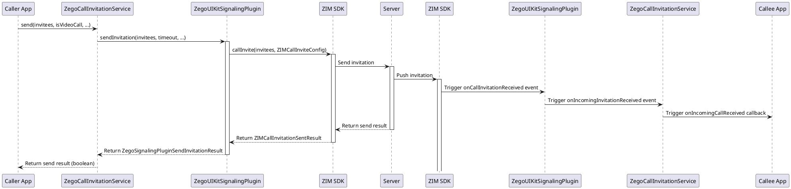
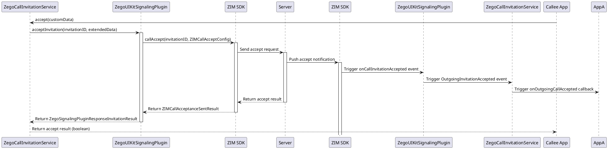
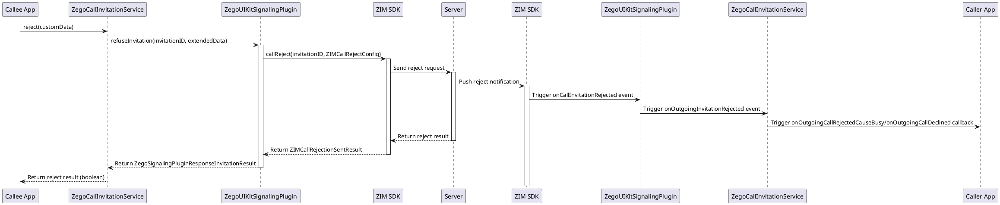
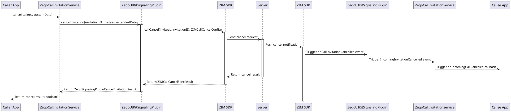
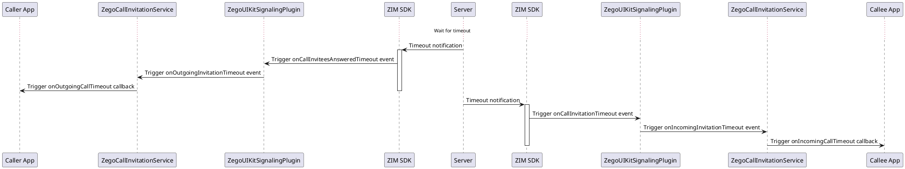

# ZEGO Call Invitation Sequence Diagrams

The following sequence diagrams illustrate the API call flows for various operations in the ZEGO Call Invitation system, implemented based on the ZIM SDK.

## Send Invitation

## Accept Invitation

## Reject Invitation

## Cancel Invitation

## Timeout Handling

These sequence diagrams illustrate the detailed flows of various operations in the ZEGO Call Invitation system, including the complete API call chain from the application layer to the ZIM SDK.
