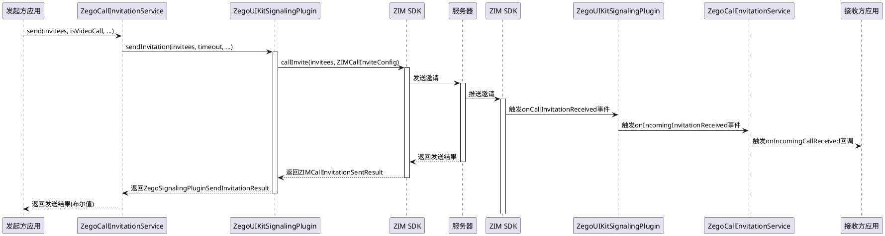
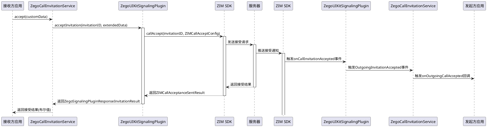
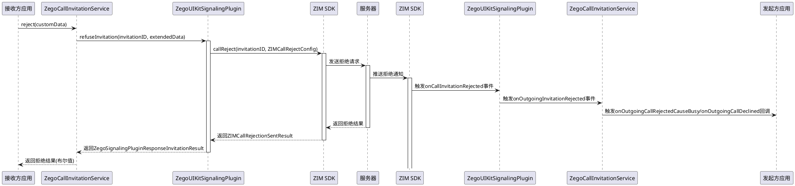
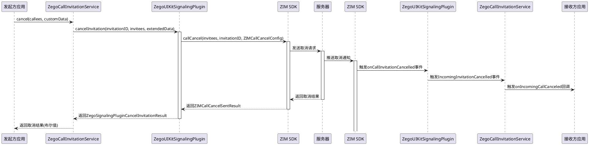
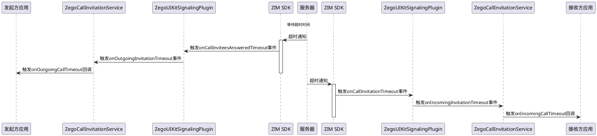

# ZEGO呼叫邀请时序图

以下时序图展示了ZEGO呼叫邀请系统中各种操作的API调用流程，基于ZIM SDK实现。

## 发起呼叫邀请 (Send Invitation)

## 接受呼叫邀请 (Accept Invitation)

## 拒绝呼叫邀请 (Reject Invitation)

## 取消呼叫邀请 (Cancel Invitation)

## 超时处理 (Timeout Handling)

这些时序图展示了ZEGO呼叫邀请系统中各种操作的详细流程，包括从应用层到ZIM SDK的完整API调用链。
